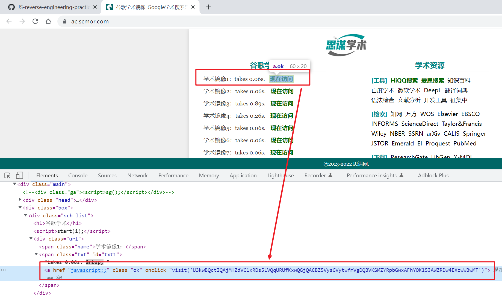
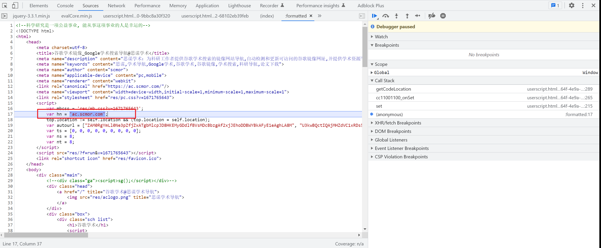
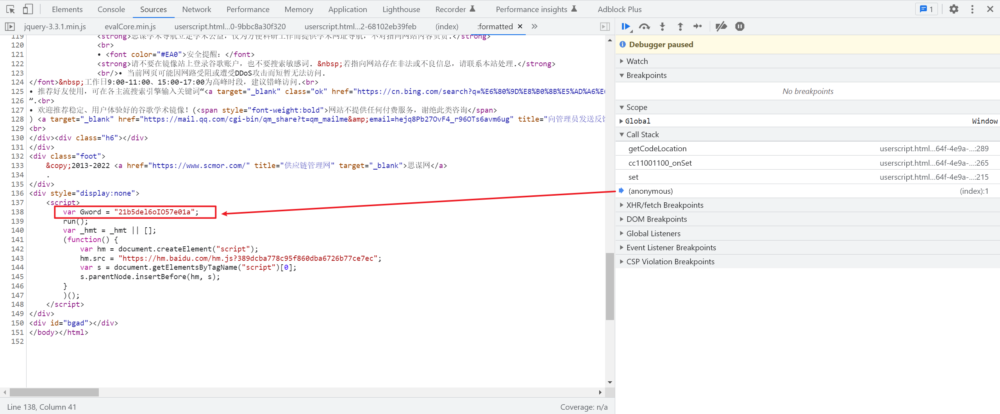
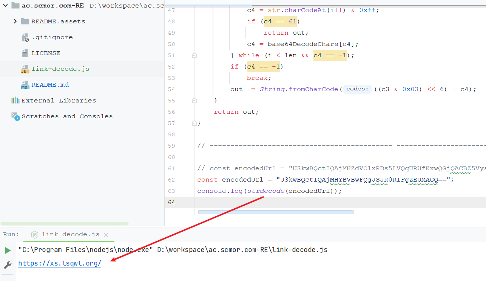

# 谷歌学术镜像

目标网址：

```
https://ac.scmor.com/
```

链接是被加密的：



跟进去`visit`：

```ja
function visit(url) {
    var newTab = window.open('about:blank');
    if (Gword != '')
        url = strdecode(url);
    newTab.location.href = url;
}
```

再跟进去`strdecode`：

```js
function strdecode(string) {
    string = base64decode(string);
    key = Gword + hn;
    len = key.length;
    code = '';
    for (i = 0; i < string.length; i++) {
        var k = i % len;
        code += String.fromCharCode(string.charCodeAt(i) ^ key.charCodeAt(k));
    }
    return base64decode(code);
}
var base64DecodeChars = new Array(-1,-1,-1,-1,-1,-1,-1,-1,-1,-1,-1,-1,-1,-1,-1,-1,-1,-1,-1,-1,-1,-1,-1,-1,-1,-1,-1,-1,-1,-1,-1,-1,-1,-1,-1,-1,-1,-1,-1,-1,-1,-1,-1,62,-1,-1,-1,63,52,53,54,55,56,57,58,59,60,61,-1,-1,-1,-1,-1,-1,-1,0,1,2,3,4,5,6,7,8,9,10,11,12,13,14,15,16,17,18,19,20,21,22,23,24,25,-1,-1,-1,-1,-1,-1,26,27,28,29,30,31,32,33,34,35,36,37,38,39,40,41,42,43,44,45,46,47,48,49,50,51,-1,-1,-1,-1,-1);

function base64decode(str) {
    var c1, c2, c3, c4;
    var i, len, out;
    len = str.length;
    i = 0;
    out = "";
    while (i < len) {
        do {
            c1 = base64DecodeChars[str.charCodeAt(i++) & 0xff];
        } while (i < len && c1 == -1);
        if (c1 == -1)
            break;
        do {
            c2 = base64DecodeChars[str.charCodeAt(i++) & 0xff];
        } while (i < len && c2 == -1);
        if (c2 == -1)
            break;
        out += String.fromCharCode((c1 << 2) | ((c2 & 0x30) >> 4));
        do {
            c3 = str.charCodeAt(i++) & 0xff;
            if (c3 == 61)
                return out;
            c3 = base64DecodeChars[c3];
        } while (i < len && c3 == -1);
        if (c3 == -1)
            break;
        out += String.fromCharCode(((c2 & 0XF) << 4) | ((c3 & 0x3C) >> 2));
        do {
            c4 = str.charCodeAt(i++) & 0xff;
            if (c4 == 61)
                return out;
            c4 = base64DecodeChars[c4];
        } while (i < len && c4 == -1);
        if (c4 == -1)
            break;
        out += String.fromCharCode(((c3 & 0x03) << 6) | c4);
    }
    return out;
}
```

注意这个函数还依赖了两个变量`Gword`和`hn`，这两个变量都是全局变量，我们借助这个插件来定位这两个变量赋值的地方：

```
https://github.com/JSREI/js-window-monitor-debugger-hook
```

`hn`初始化的地方：



`Gword`赋值的地方，隐藏在了百度统计的一个`script`中：



至此分析完毕，抠出来的代码详见[link-decode.js](./link-decode.js)，运行：



完毕。


